# FoodLens: Recipe Analytics & Machine Learning

## Overview
> **"What drives people to like and save recipes online?"**

The answer turned out to involve comfort food psychology, cultural identity, ingredient complexity, and the neuroscience of recipe titles.
The project analyzes more than 10,000 recipes collected from the public website `eda.ru` to explore:

* recipe popularity,
* nutrition trends,
* user engagement patterns,
* and semantic recipe similarity.

The project combines web scraping, exploratory data analysis (EDA), feature engineering, statistical analysis, machine learning, and NLP techniques to generate meaningful business and consumer insights.

---

# Business Problem

Modern recipe platforms contain thousands of recipes, making it difficult for users to efficiently discover recipes that match their interests, dietary preferences, and nutritional needs.

Traditional keyword-based search systems often fail to capture semantic meaning and user intent. Additionally, food platforms may struggle to understand which recipe characteristics influence user engagement and popularity.

This project aims to:

* analyze factors affecting recipe popularity,
* improve recipe discovery using semantic search,
* predict nutritional values using machine learning,
* and generate data-driven insights for food recommendation systems.

---

# Skills Demonstrated

* Web Scraping
* Data Cleaning & Preprocessing
* Exploratory Data Analysis (EDA)
* Feature Engineering
* Statistical Analysis
* Hypothesis Testing
* Machine Learning
* Natural Language Processing (NLP)
* Data Visualization
* Semantic Search Systems

---

# Technologies Used

| Technology           | Purpose                             |
| -------------------- | ----------------------------------- |
| Python               | Main programming language           |
| Pandas               | Data manipulation and preprocessing |
| NumPy                | Numerical computations              |
| BeautifulSoup        | Web scraping                        |
| Requests             | HTTP requests                       |
| Scikit-learn         | Machine learning models             |
| SentenceTransformers | NLP embeddings & semantic search    |
| Matplotlib,plotly    | Data visualization                  |
| Seaborn              | Statistical visualization           |
| SciPy                | Statistical analysis                |


---


## 📂 Project Structure

```
recipe-analysis/
│
├── data/
│   └── recipes_clean.csv        # Cleaned dataset (10,000+ recipes, 15 features)
│
├── notebooks/
│   └── recipe_analysis.ipynb    # Main Google Colab notebook
│
├── presentation/
│   └── recipe_website_analysis.pdf
│
└── README.md
```

---


## Pipeline

```
Web Scraping  →  Preprocessing  →  EDA  →  Hypothesis Testing  →  ML Models  →  Semantic Search
```

### 1 Data Collection — Web Scraping
**Source:** [eda.rambler.ru](https://eda.rambler.ru) · **Libraries:** `requests`, `BeautifulSoup`

The data wasn't available in plain HTML — it was embedded as **JSON inside the page source**. The scraping pipeline:

1. Extracted recipe card links from the main page
2. Visited each recipe page individually
3. Located and parsed the embedded JSON to extract structured fields

**Result:** 10,000+ rows × 15 columns, zero null values.

| Feature Category | Columns |
|---|---|
| Nutritional values | calories, proteins, fats, carbohydrates |
| Recipe characteristics | cuisine, dish type, ingredients, portion size, dietary category |
| User feedback | likes, dislikes |

### 2 Preprocessing

**Step 1 — Loading & Inspection**
Examined structure, dimensions, and data types. Removed duplicate records.

**Step 2 — Missing Values**
- `Cuisine` nulls → filled with `"Unknown"`
- Missing descriptions → filled from the `text` column

**Step 3 — Cleaning & Transformation**
- Standardized column names
- Fixed data types (numeric / categorical conversions)
- Transformed `Ingredients` from raw text into structured Python lists

**Step 4 — Outlier Handling**
- Identified outliers in `calories`, `fats`, `proteins`, `duration` via visualization
- Normalized total nutritional values by portion count → more realistic per-portion data

**Step 5 — Feature Engineering**

| New Feature | Description |
|---|---|
| `Likes Ratio` | Measures user satisfaction (likes / total votes) |
| `Calories per Portion` | More accurate nutritional metric |
| `Dietary Focus` | Categorizes recipes: High Protein, Balanced, High Carbs, etc. |
| `Dish Type` | Extracted from URL: breakfast, dessert, salad, etc. |
| `Time Effort` | Grouped cooking time into Express / Standard / Time-Consuming |

Ingredients were also exploded into a separate structure using `df.explode()` for per-ingredient analysis.

**Step 6 — Encoding & Standardization**
- Categorical variables (e.g. `Cuisine`) encoded to numerical format for ML
- Numerical features scaled for consistent model performance

---

##  Key Findings

###  Carbs Win. Always.
High-calorie recipes get **27% more likes** on average (p = 0.003). But the surprise: it's not fat — it's **carbs** that drive engagement. Comfort foods (bread, pasta, potatoes) beat "heavy/greasy" foods every time.

> *"The heart wants indulgence, but the click follows comfort and culture."*

###  Culture Matters
Italian vs. Russian cuisine t-test (p = 0.014): **Italian recipes get 36% more likes**.  
Italian food leverages universally loved ingredients (pasta, cheese, tomato). Russian cuisine is "niche gourmet" — high barrier to entry for the average global user.

**For content creators:** Post Italian for consistent growth. Post Russian for niche authority.

###  The Quick & Healthy Paradox
Low-calorie and high-protein meals are **actually faster to prepare** than high-carb/fat dishes. The myth that healthy eating takes too much time is debunked by the data.

###  The 8-Ingredient Sweet Spot
The optimal number of ingredients for maximum saves is **8**. Complexity scares people away. Correlation between ingredient count and saves: **-0.13**.

Exception: recipes with 35+ ingredients (elaborate wedding/event dishes) see an unexpected spike — the "Special Occasion" effect.

###  Simplicity Wins — Even in Titles
Short recipe names drive virality. Our brains prefer **"Brownies"** over **"Artisanal Hand-Crafted Cocoa Squares."** Complexity in the title creates a measurable barrier to engagement.

###  Risk vs. Reward: Polarizing Dishes
Breakfasts and drinks are the most "controversial" dish types (highest dislikes per like). Likely reason: high expectations for "simple" categories lead to disappointment.

---
##  Visualizations
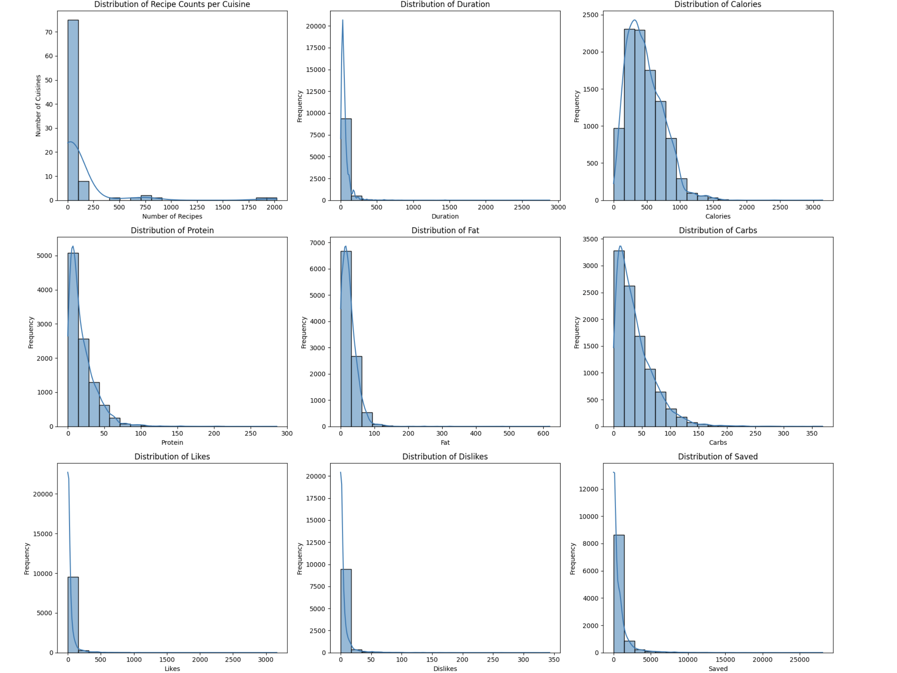

> The dataset spans a wide range of calorie counts and macro distributions. Most recipes cluster in moderate calorie ranges, with a long right tail — a small number of dishes are extremely calorie-dense.
 
---

**Do high-carb or high-fat diets get more likes?**

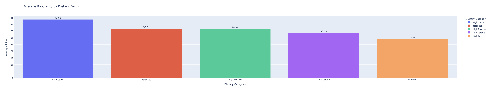
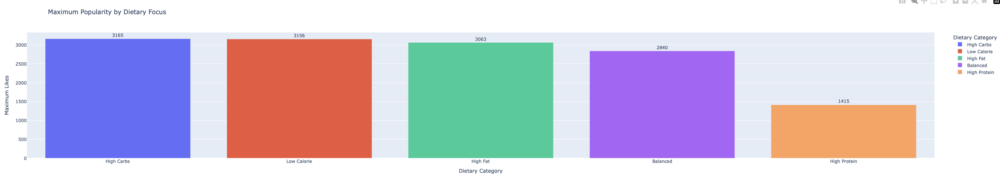

> High-Carb recipes lead both in average and maximum likes. High-Fat recipes consistently underperform — suggesting users prefer comfort carbs over rich, greasy food. Social media engagement favors indulgence, but specifically the *carb* kind.

---

**Which cuisines drive the "High Fat" category?**

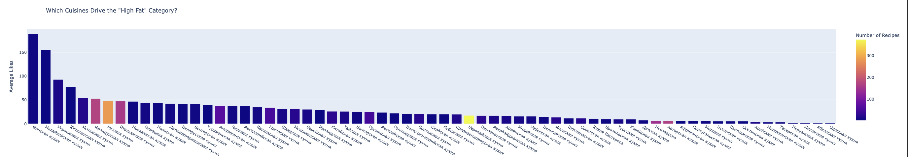

> European, French, and Russian cuisines dominate the high-fat segment. Despite the richness of these dishes, they receive lower average engagement — supporting the idea that high-fat food is "niche gourmet" rather than universally appealing.

---

**How many ingredients do the most popular cuisines use on average?**

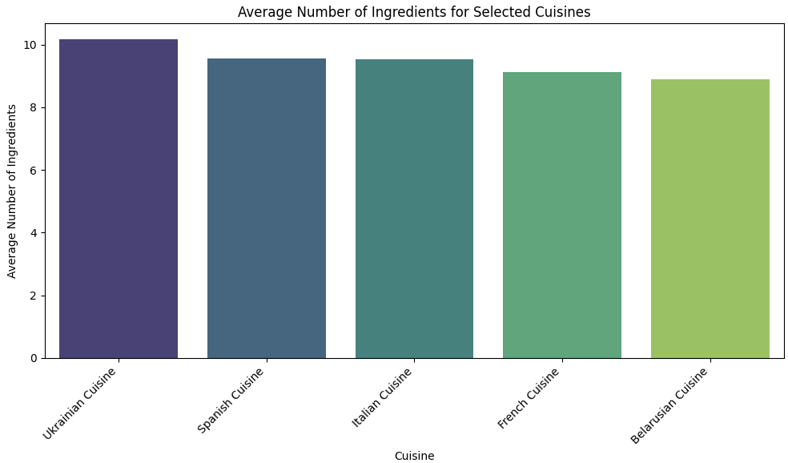

> The top 5 cuisines by likes all average between 8–10 ingredients. This isn't a coincidence — it reflects the sweet spot between complexity and approachability.
**Does adding more ingredients hurt or help a recipe's saves?**

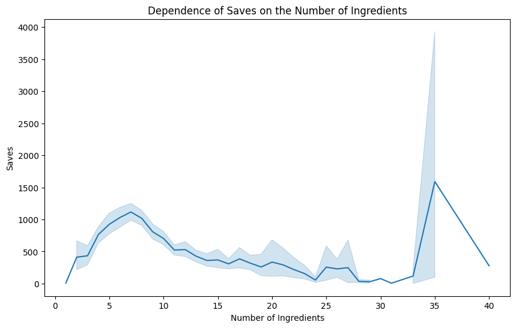

> Saves peak around **8 ingredients** and decline steadily beyond that (correlation: -0.13). The one exception is a dramatic spike at 35+ ingredients — a single elaborate recipe, likely for a special occasion like a wedding dish.

---

**Does a recipe's title length affect how many saves it gets?**

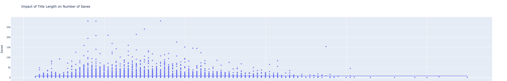

> Shorter titles clearly concentrate the highest-save recipes. As title length grows, save counts drop and spread thins out. The data supports a simple rule: if you can say it in fewer words, do it.

---

**Which ingredients drive popularity — and which kill it?**

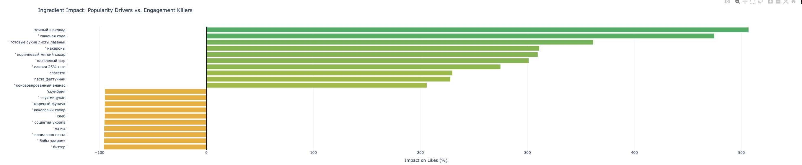

> Ingredients like dark chocolate, baking soda, lasagna sheets, and pasta show massive positive lift on likes. On the negative side, niche or unfamiliar ingredients consistently reduce engagement. Many of the top positive ingredients are staples of Italian cuisine.

---

**Which dish types are the most controversial (high dislikes per like)?**

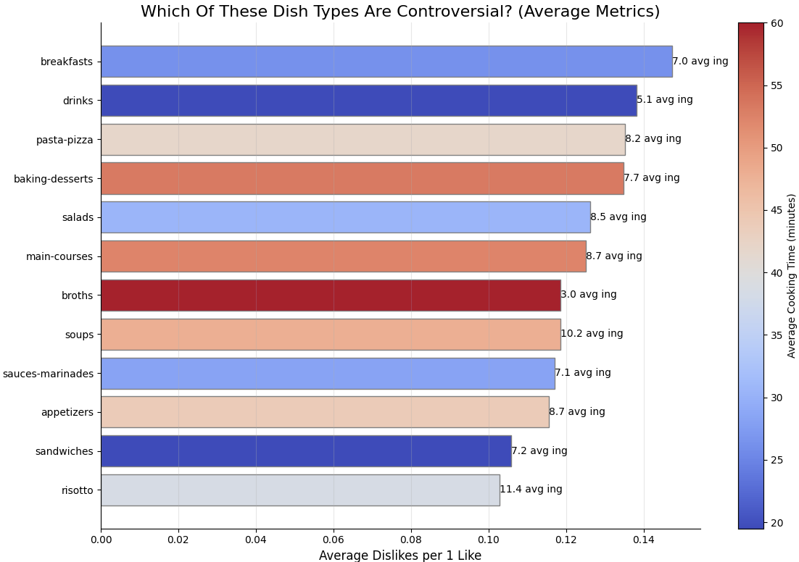

> Breakfasts and drinks receive the most dislikes relative to likes. The likely reason: users have high expectations for "simple" categories, and even small misses lead to negative feedback.

---

**Is there a pattern between preparation speed and nutritional focus?**

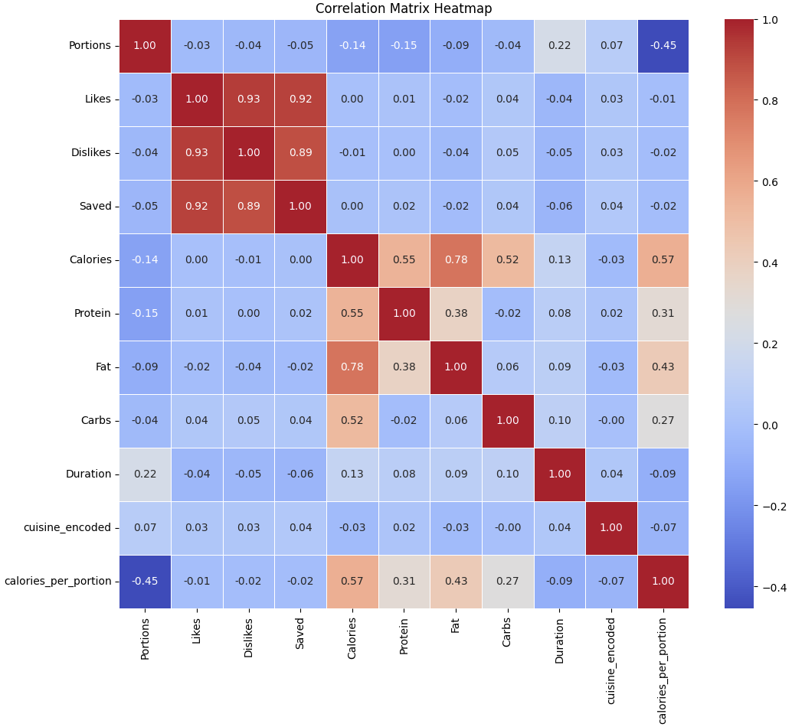

> Low-calorie and high-protein recipes cluster in the "Express" preparation category, while high-carb dishes dominate "Standard" time. This debunks the myth that healthy food takes longer to prepare.

---
## Machine Learning

### Model 1 — Calorie Predictor
> *"Can we guess the calories if we only know the macros?"*

| Metric | Value |
|--------|-------|
| R² Score | **0.96** |
| Top Predictor | Fat (69% importance) |
| Use Case | Instant calorie calculator for untagged recipes |

### Model 2 — Semantic Recipe Search
Built using **SentenceTransformer** to understand search *intent*, not just keywords.

| Query (RU) | Top Score | Result |
|------------|-----------|--------|
| ПП завтрак с яйцами | 0.82 |  Excellent |
| быстрый ужин с курицей | 0.81 | Perfect |
| завтрак для детей | 0.72 |  Strong |

**How well does the semantic search system understand user intent?**

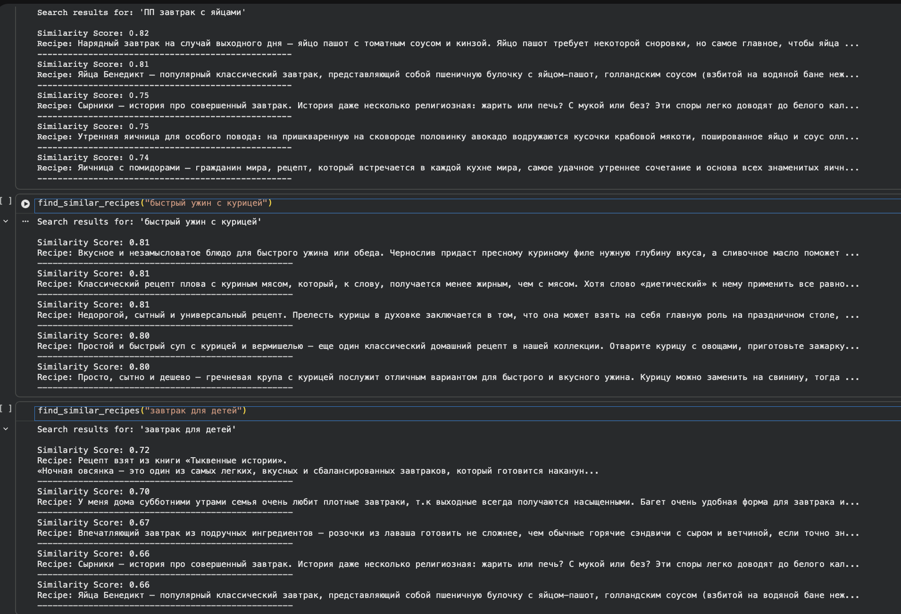

> Queries in natural Russian (e.g. "quick dinner with chicken") return highly relevant results with scores above 0.80. The system understands meaning, not just keywords — though a data gap toward drinks/bar menus was revealed during testing.


---

##  Recommendations

**For Content Creators & Chefs:**
- Use the **8-ingredient rule** — simplicity converts
- **Rebrand healthy options** to mimic comfort-food aesthetics
- Keep **recipe titles short** — every extra word loses engagement

**For Platform Developers (eda.rambler.ru):**
- Implement **automated calorie tagging** using the ML model
- Add **dynamic search filtering** (by time, dietary focus)
- Build **personalization** based on cuisine affinity

---

##  

---

# Author

Akmeiir Amirseit

